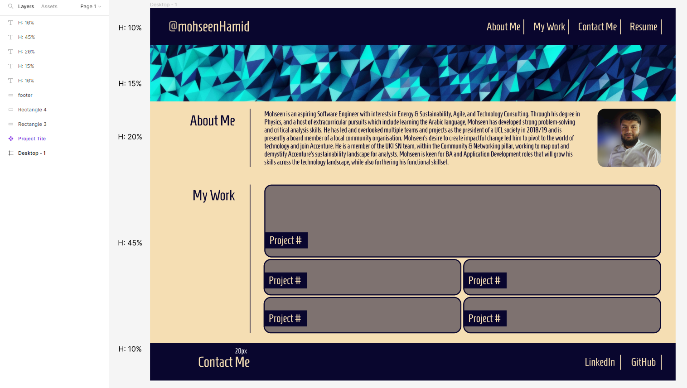
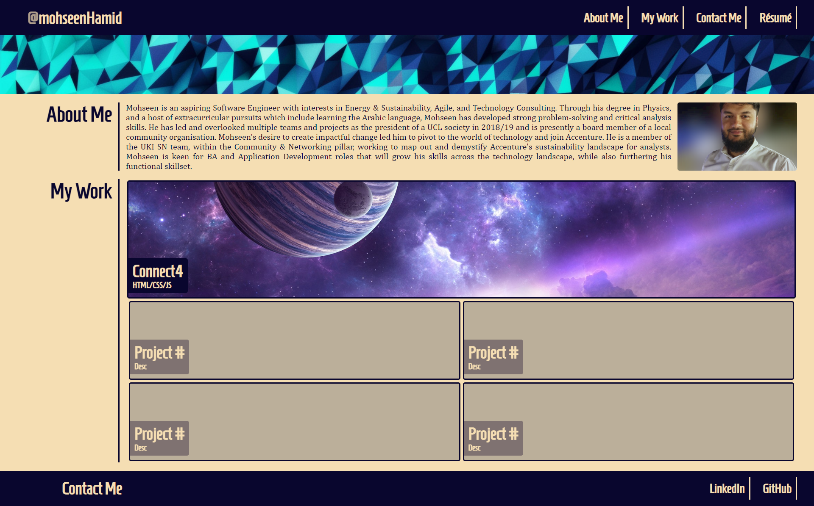
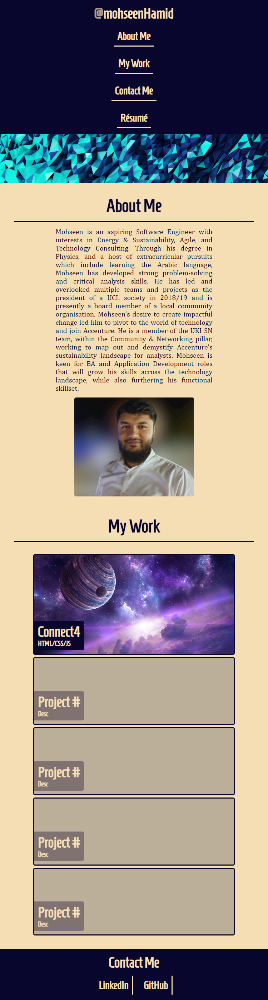

# Week 2 Challenge: Working with CSS

## Description

The task was to create a professional portfolio webpage that displays my projects to date. In doing so, I'd be using the new HTML & CSS web dev skills I've learnt to date namely, flexbox, media queries, and CSS variables.

## User Story

```
AS A job applicant
I WANT a webpage that displays my professional biography
SO THAT a hiring manager has a single source of truth to get to know me and see my work
```

## Acceptance Criteria

Here are the critical requirements necessary to develop a portfolio that satisfies a typical hiring manager’s needs:

- When the page is loaded the page presents your name, a recent photo or avatar, and links to sections about you, your work, and how to contact you
- When one of the links in the navigation is clicked then the UI scrolls to the corresponding section
- When viewing the section about your work then the section contains titled images of your applications
- When presented with the your first application then that application's image should be larger in size than the others
- When images of the applications are clicked then the user is taken to that deployed application
- When the page is resized or viewed on various screens and devices then the layout is responsive and adapts to my viewport

## Usage

This is a static webpage that contains a navigation bar in the header. Click the links to go to the content sections of the page. In the "My Work" section, click on the tiles to be taken to the respective project's GitHub repo.

## Mock-Up

This portfolio webpage includes:

- a header containing a page title + navigation bar
- a hero banner
- a main body containing 2 sections
  1. About Me: a brief professional biography
  2. My Work: a tiled layout of my projects (that can be clicked)
- a footer containing contact info

Please see below a screenshot of the figma wireframe:


Please see below a link to the figma wireframe of the webpage:

- https://www.figma.com/file/FpdVq5dlxMxByHo35mkCRz/tsbc-challenge-2-mh?node-id=0%3A1&t=P4SSiwnPnoA10f2h-1

Please see below screenshots of the webpage:

Full-Size


Mobile (768px)


The following link takes you to the GitHub Pages deployment of the website:

- https://mohseenhamid.github.io/tsbc-challenge-2-mh/

## Credits

N/A

## License

Please refer to the LICENSE in the repo.
